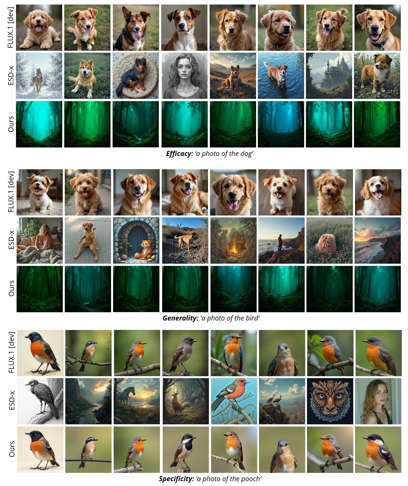

## Figure R1: Qualitative comparison on dog erasure on FLUX.1 [dev]. Comparison of Efficacy (prompt: "dog" - unlearned prompt), Generality (prompt: "pooch" - synonym prompt), and Specificity (prompt: "bird" - unrelated prompt).  
--- 
## Figure R2: Failure cases. Visualizations of NSFW erasure challenges and cases of over-unlearning (e.g., "nude color dress", "medical anatomy"). 
